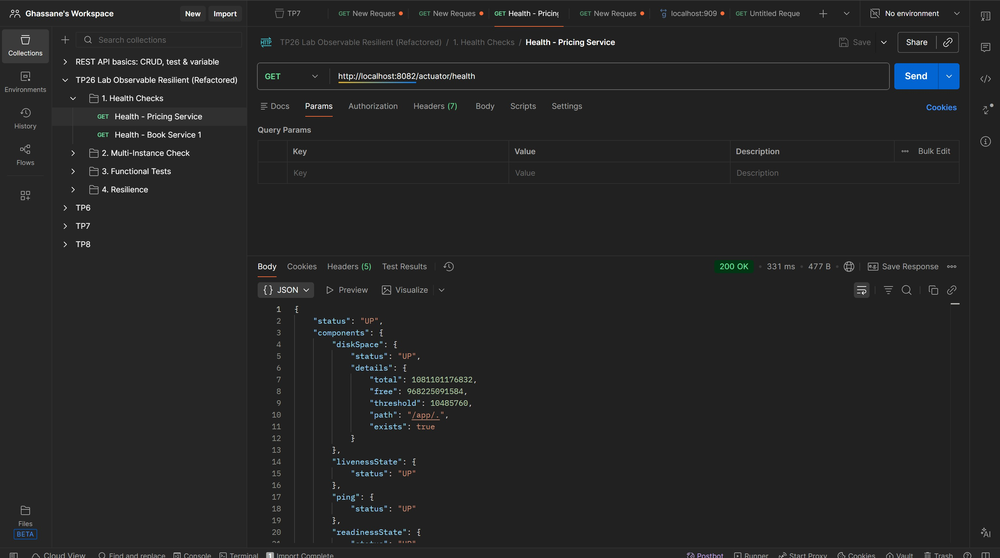

# TP 26 : Microservice Observable & Résilient

Ce projet met en œuvre une architecture microservices robuste utilisant Spring Boot, Docker, MySQL, et Resilience4j.

## Architecture

Le système est composé de 2 services principaux :

1.  **pricing-service** : Microservice simulant un service de tarification (peut être instable).
2.  **book-service** : Microservice de gestion de livres (3 instances pour la haute disponibilité) qui consomme *pricing-service*.
3.  **MySQL** : Base de données partagée pour *book-service*.

### Fonctionnalités Clés
*   **Actuator** : Healthchecks (Liveness/Readiness).
*   **Resilience4j** : Circuit Breaker et Retry pour gérer les pannes de *pricing-service*.
*   **Docker Compose** : Orchestration complète avec `wait-strategy`.
*   **Load Balancing** : 3 instances de *book-service* derrière un load balancing (simulé par ports exposés).
*   **Verrouillages DB** : Gestion de la concurrence via `PESSIMISTIC_WRITE`.

## Prérequis

*   Docker Desktop & Docker Compose
*   Java 17 ou 21 (pour build local)
*   Postman (pour les tests)

## Démarrage Rapide

1.  **Builder et Lancer la stack** :
    ```bash
    docker compose up -d --build
    ```

2.  **Vérifier les services** :
    *   Pricing : [http://localhost:8082/actuator/health](http://localhost:8082/actuator/health)
    *   Book 1 : [http://localhost:8081/actuator/health](http://localhost:8081/actuator/health)
    *   Book 2 : [http://localhost:8083/actuator/health](http://localhost:8083/actuator/health)
    *   Book 3 : [http://localhost:8084/actuator/health](http://localhost:8084/actuator/health)

## Tests et Validation



Une collection Postman `postman_collection.json` est incluse pour tester les scénarios suivants :

1.  **Santé** : Vérification des endpoints Actuator.
2.  **Multi-instances** : Vérification des IDs d'instance différents sur `/api/debug/instance`.
3.  **Base de données** : Création sur une instance, lecture sur une autre.
4.  **Résilience** :
    *   Forcer la panne de pricing : `GET /api/prices/1?fail=true`
    *   Emprunter un livre : Le système ne doit pas crasher (Fallback prix 0.0).

## Commandes Utiles

Arrêter la stack :
```bash
docker compose down
```

Vérifier les logs :
```bash
docker compose logs -f
```
